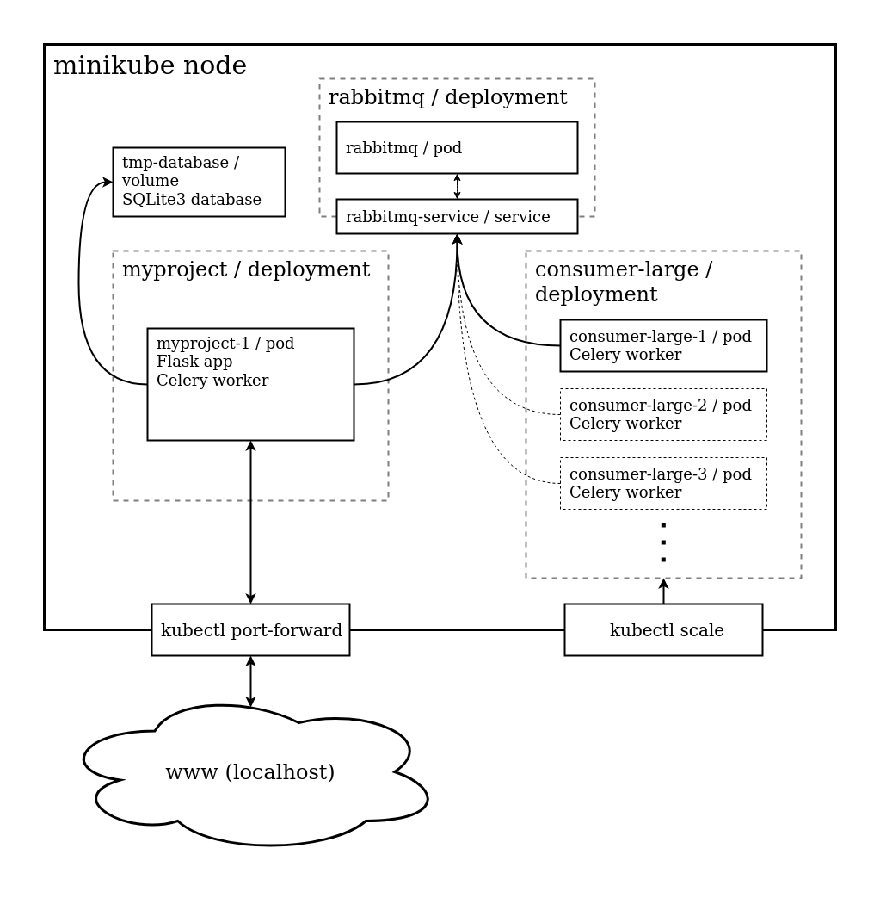

Toy example of a RESTful service computing long running tasks asynchronously using two different queues depending on input size.
The message broker delegates tasks either to local workers or a Kubernetes cloud, containing a scalable setup for workers.
Small input is consumed locally, while large input is consumed remotely.

The service is represented by ``myproject`` and the long running tasks by a Python library named ``lcs``, containing a poor implementation of a longest common substring algorithm.

### Sketch



### Requirements

* [Django](https://www.djangoproject.com)
* [Django REST framework](http://www.django-rest-framework.org)
* [Celery](http://www.celeryproject.org)
* [RabbitMQ](https://www.rabbitmq.com)
* [Minikube](https://github.com/kubernetes/minikube)

### Running locally

Please first install Minikube according to the installation instructions provided [here](https://github.com/kubernetes/minikube).
Minikube will be running a VM, and can therefore be a bit more challenging to get running compared to a simple Python package or systemd service.
The host system used in this example was an Ubuntu 16.04 with virtualization provided by KVM and the Minikube KVM2 driver.

Assuming Minikube is properly installed, and the current user is allowed to run virtualizations, start the Kubernetes cluster (replace the driver name if not using KVM):
```
minikube start --vm-driver kvm2
```
Update the address of your RabbitMQ service in ``consumer/kube-deployment.yaml``.
If RabbitMQ is running locally, Minikube needs to access the host machine.
The host address is (most likely) the first address in the virtual network created by Minikube:
```
minikube ip | sed 's/[0-9]\+$/1/'
```
Now, build a Docker image for the consumer client.
First, set some environment variables for the current terminal instance to share the host Docker daemon with the Minikube VM:
```
eval (minikube docker-env)
```
Build the consumer container:
```
docker build --tag lcs:1 --file consumer/lcs.dockerfile .
```
Minikube should now be able to create containers from the ``lcs:1`` image.

Now, create a Deployment that deploys consumer containers into the local Kubernetes cluster:
```
kubectl create --filename consumer/kube-deployment.yaml
```
Kubernetes should now start deploying the consumers into pods:
```
kubectl get pods
```


If Minikube cannot connect to its virtual network, check the state of the ``minikube-net`` network:
```
virsh net-list
```
If ``minikube-net`` is inactive:
```
virsh net-start minikube-net
```
Then start Minikube normally.
